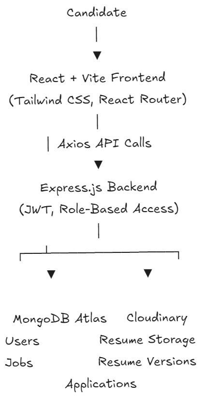
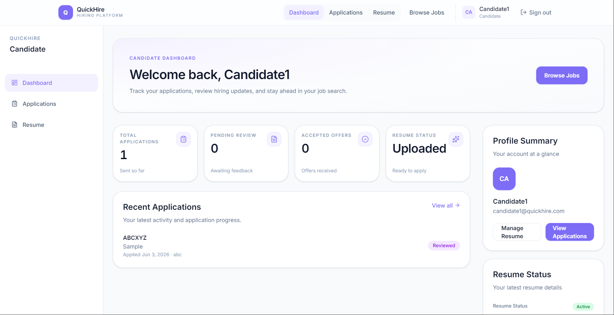
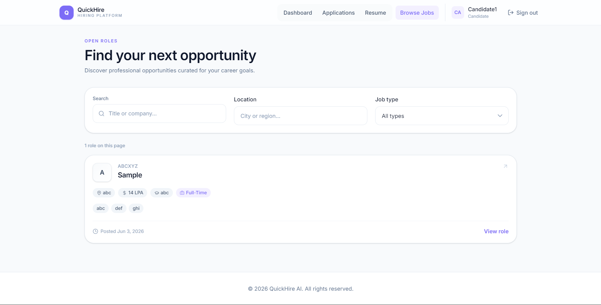
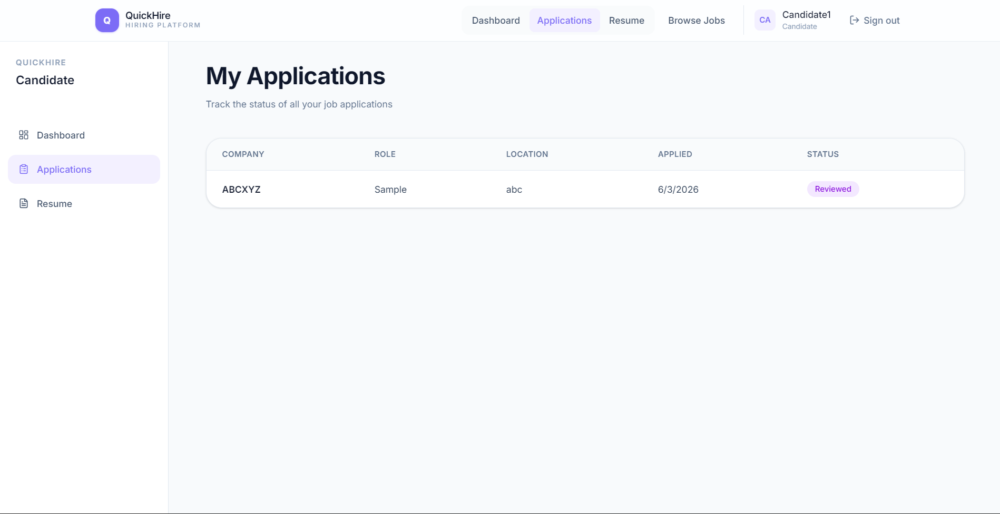
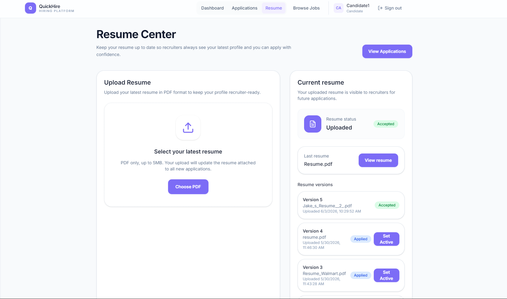
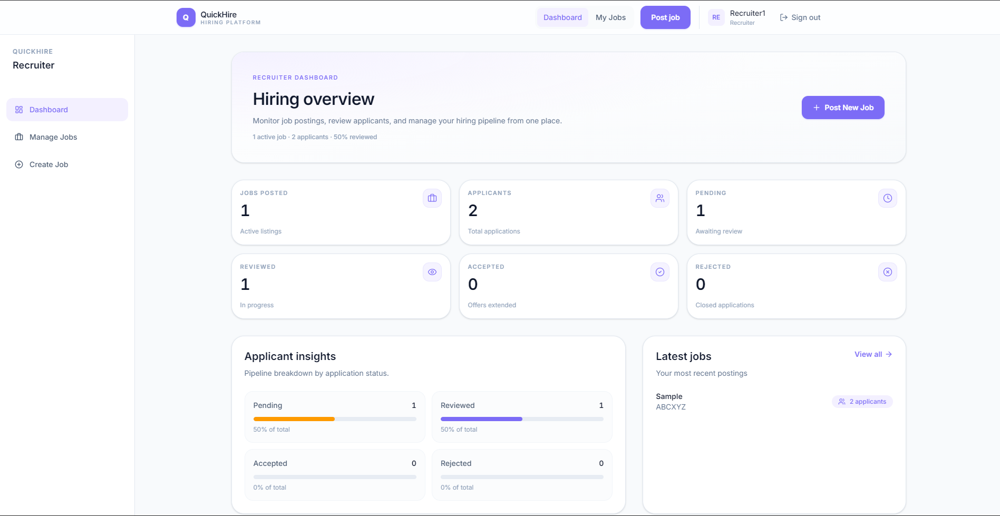
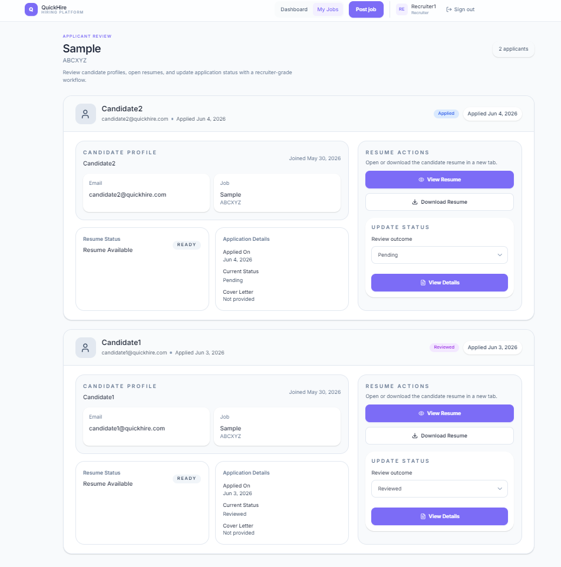
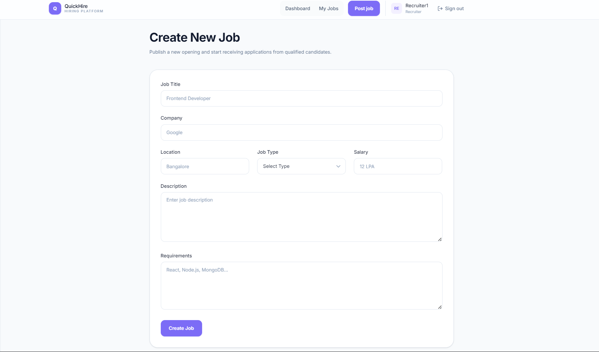

# QuickHire AI

QuickHire AI is a full-stack Applicant Tracking System (ATS) and job portal built for candidates and recruiters. Candidates can discover roles, manage resume versions, apply to jobs, and track applications. Recruiters can publish openings, review applicants, access resumes, and update hiring status — all in a modern purple SaaS interface.


## Live Demo

🌐 Live Application: http://16.171.232.137/

> Hosted on AWS EC2 using Nginx and PM2.

## Highlights

- Full-Stack ATS & Job Portal
- Resume Versioning System
- Role-Based Authentication (Candidate & Recruiter)
- Applicant Tracking Workflow
- Cloudinary Resume Storage
- Responsive SaaS-Style UI
- JWT Secure Authentication

## Features

### Candidate Features

- Secure authentication and role-based dashboard
- Browse and search jobs with filters (keyword, location, job type)
- Job details and one-click apply workflow
- Application tracking with status badges
- Resume upload (PDF), view, and download
- Resume versioning with active version selection

### Recruiter Features

- Recruiter dashboard with hiring pipeline stats
- Create, edit, and delete job postings
- View applicants per job with detailed profiles
- Resume view and download for each applicant
- Application status updates (pending, reviewed, accepted, rejected)

### Resume Versioning

- Upload multiple PDF resume versions via Cloudinary
- Activate any previous version as the current resume
- Active resume is used for new applications and recruiter visibility

### ATS Workflow

1. Recruiter posts a job → job appears in the public browse list
2. Candidate uploads resume and applies → application is created
3. Recruiter reviews applicants, opens resume, updates status
4. Candidate tracks progress from the applications dashboard

## Tech Stack


| Layer              | Technologies                                                                     |
| ------------------ | -------------------------------------------------------------------------------- |
| **Frontend**       | React 19, Vite, Tailwind CSS, React Router, Axios, react-hot-toast, Lucide icons |
| **Backend**        | Node.js, Express, Mongoose, JWT, Helmet, rate limiting                           |
| **Database**       | MongoDB Atlas                                                                    |
| **Cloud Storage**  | Cloudinary (resume files via Multer)                                             |
| **Authentication** | JWT (Bearer token in `localStorage`)                                             |
| **Deployment**     | AWS EC2, Nginx, PM2                                                              |


## Architecture

QuickHire AI follows a classic **SPA + REST API** architecture:

- The **React client** handles routing, UI state, and calls the API through a shared Axios instance (`VITE_API_URL`).
- The **Express server** exposes `/api/auth`, `/api/jobs`, and `/api/applications` routes with JWT middleware and role checks.
- **MongoDB** stores users, jobs, and applications; resumes are stored in **Cloudinary** with URLs persisted on the user record.




## Screenshots

### Candidate Dashboard



### Browse Jobs



### Applications



### Resume Management



### Recruiter Dashboard



### Applicant Management



### Create Job



## Installation

### Prerequisites

- Node.js 18+
- MongoDB Atlas cluster
- Cloudinary account

### Backend setup

```bash
cd server
npm install
cp .env.example .env
# Fill in MONGO_URI, JWT_SECRET, Cloudinary keys, CLIENT_URL
npm run dev
```

### Frontend setup

```bash
cd client
npm install
cp .env.example .env
# Set VITE_API_URL=http://localhost:5000/api for local dev
npm run dev
```

Open `http://localhost:5173` after both servers are running.

### Environment variables

**Server (`server/.env`)**


| Variable       | Description                          |
| -------------- | ------------------------------------ |
| `PORT`         | API port (default `5000`)            |
| `MONGO_URI`    | MongoDB Atlas connection string      |
| `JWT_SECRET`   | Secret for signing tokens            |
| `CLOUDINARY_`* | Cloud name, API key, API secret      |
| `CLIENT_URL`   | Comma-separated allowed CORS origins |
| `NODE_ENV`     | `development` or `production`        |


**Client (`client/.env`)**


| Variable       | Description                                               |
| -------------- | --------------------------------------------------------- |
| `VITE_API_URL` | Backend API base URL (e.g. `https://api.example.com/api`) |


## Deployment

- Frontend        :     Nginx
- Backend         :     Node.js managed by PM2
- Reverse Proxy   :     Nginx
- Hosting         :     AWS EC2
- Database        :     MongoDB Atlas
- Resume Storage  :     Cloudinary

## Future Roadmap

### Phase 2: Personal Career CRM

- External application tracking (LinkedIn, Internshala, Wellfound, Naukri, company career pages)
- Interview scheduling and notes
- Assignment tracking and reminders
- Resume-to-application mapping
- Follow-up reminders and notifications
- Resume performance analytics
- Job search insights dashboard

## Author

Built by **Satyam Pandey**.

- GitHub: [Satyam-8226](https://github.com/Satyam-8226)
- Project: [quickhire-ai](https://github.com/Satyam-8226/quickhire)